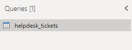

#### Hello and welcome to my Github DataAnalytics repository. The purpose of this repository is to highlight some of the PowerBI projects I have worked on and provide a high level overview of the project details.

 

- [1. Global Superstore](#1-global-superstore)
  - [1.1. Data Loading](#11-data-loading)
  - [1.2. Data Modelling](#12-data-modelling)
  - [1.3. Report Design](#13-report-design)
  - [1.4. Additional Commentary](#14-additional-commentary)
- [2. IT Helpdesk Tickets](#2-it-helpdesk-tickets)
  - [2.1. Data Loading](#21-data-loading)
  - [2.2. Data Modelling](#22-data-modelling)
  - [2.3. Report Design](#23-report-design)
  - [2.4. Additional Commentary](#24-additional-commentary)

 
 

# 1. Global Superstore
"*The Global Superstore dataset is a simulation of retail sales operations with stores in multiple countries. It includes information about customers, orders and products, which is particularly useful for exploring retail sales data, as it offers a large and diverse set of data that can be used to analyse customer behaviour, product performance and sales patterns.*"

Dataset Source: https://www.kaggle.com/datasets/shekpaul/global-superstore

## 1.1. Data Loading 
-   The Excel file contains three tabs; **Orders**, **People** and **Returns**
-   The file is loaded into 3 separate tables where each table extracts data from 1 of the 3 tabs
-   Transformations applied include Promoting headers and changing data types
  

## 1.2. Data Modelling
-   A calendar dimension table is created to allow users to filter by month, quarter and year
-   The calendar table is also necessary for time intelligence functions
-   To create the calendar table, CALENDAR() is utilised with [Order date] as min and max parameters. This ensure all dates from the order table are captured in the dimension table
-   **[Year]**, **[Month]** and **[Start of the Month]** are calculated columns derived from **[Date]**

 
## 1.3. Report Design
1. **Sales**  - Shows the monthly sales and sales movement % compared to previous month
2. **No of Orders** - Shows the monthly order and order movement % compared to previous month
3. **Countries** - Highlights the highest revenue generating countries in last 6 months and their sales in last 12 and 18 months
4. **Ship mode** - Breakdown of shipment methods. This information could be used to gain a better pricing deal with most frequently used curriers
5. **Sales % by Segments** - Breaks revenue down by consumer type month over month
6. **Returns** - Highlights the number of orders returned for each period
   

## 1.4. Additional Commentary 
-   The dashboard is targeted at senior leadership and likely to be used within board-packs. It offers a cleaner look by not having report filters on the page.
-   By default, any orders returned have been discounted from all visuals except the Returns Visual.  

 
 

# 2. IT Helpdesk Tickets
"*The helpdesk tickets dataset simulates service tickets within an organisation. It contains details about the issue, status, requester, assigned agent, priority, and many other features, making it an excellent resource for evaluating IT performance.*"

Dataset Source: Online Course

## 2.1. Data Loading 
-   The Excel file contains a single tab "helpdesk_tickets" which is imported in PowerBI using Excel connector 
-   Header is promoted and data types assigned

## 2.2. Data Modelling
-   The calendar dimension table is created as its a good practice to separate dimension and facts table
-   A new table is created to host all measures required for the report 

## 2.3. Report Design

- **No. of Tickets** - No of open vs closed tickets. Useful to identify open tickets for prior months which should have been resolved
- **Team Assigned** - Tickets assigned against each team and further breakdown of status. Useful to identify teams that may require change in resource to operative effectively
- **Outstanding Tickets** - Split between breached and non-breached service level agreement. A further split highlighting the duration of the breach. This will enable the team to work through the backlog and clear it down
- **Ticket Issued Origin** - Month over month visibility as per the issue origin
- **Agent Performance Review** - Visibility of agent performance. Allows manager to assess performance, workload and identify areas of improvement

## 2.4. Additional Commentary 
- A dedicated filters panel is created within the report as users are expected to interact with the operational report
- The compliance Gauge visual turns green once it surpasses the 80% arbitrary target value
